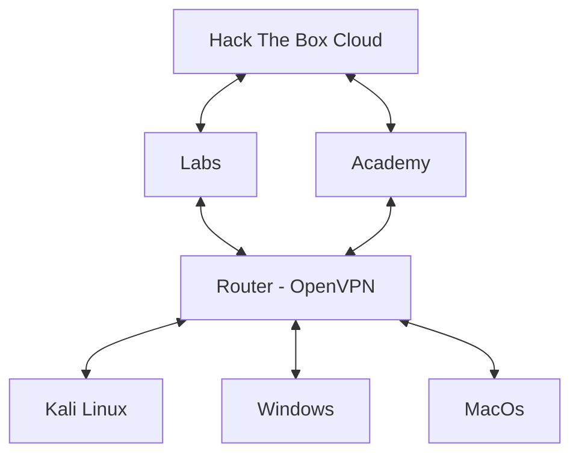

## Objective

Due to my current setup (MacBook M1), I rely on virtualizing Kali Linux.
This significantly reduces available system resources when running heavy tools such as BloodHound, Neo4j, Metasploit, or large AD enumeration frameworks.

In several cases, running BloodHound causes my VM to freeze or become unusable, forcing me to split the workflow:

- Collect data in one environment
- Switch back to Kali to continue the attack

This is inefficient and breaks the workflow.

## Goal

The objective of this setup is to configure a GL.iNet Router (GL-SFT1200 / SL1200) as a centralized **Hack The Box VPN gateway**, allowing multiple devices to access HTB machines transparently without running **OpenVPN** locally on each host.

## Benefits

**With this approach:**
- Only the router runs the VPN
- All connected clients route traffic through the VPN
- DNS is centrally managed
- No /etc/hosts modifications are required on client machines
- Heavy tooling can run on a dedicated Kali box or server
- Lightweight devices can still interact with targets

## Network Topology
**Hardware and Firmware**
- **Router**: GL.iNet GL-AC1200
- **VPN Type**: OpenVPN (HTB client generated)


## Setup

### SSH Connection
```console
ssh -o HostKeyAlgorithms=+ssh-rsa -o PubkeyAcceptedAlgorithms=+ssh-rsa root@192.168.8.1
```
(Default GL.iNet LAN IP is 192.168.8.1)

### Hack The Box Environment
#### Adding the vpn files
We need to add the VPN file to the dashboard.
1. Go to **VPN**
2. Select **OpenVPN Client**
3. (Optional) Create a new group
4. Click *Upload Configuration File*
5. Drag and drop or search and select the `.ovpn` client
6. Return to  **VPN Dashboard**

#### Configuring for full network access

1. Click the gear icon (Options) next to your VPN profile
   1. Enable the *IP Masquerading*
2. Click **Global Options**
   1. Enable *Allow Access WAN*
3. Click the **Modify Proxy Mode**
   1. Select *Auto Detect*

> Only one OpenVPN client can run at a time on the router.

#### Firewall and Routing
In most cases, GL.iNet handles NAT automatically, but depending on firmware and VPN routes, manual rules may be required.

##### Detect the Openvpn interface
```console
ip route | grep 10.
```

Example output:
```console
root@GL-SFT1200:~# ip route | grep 10.
10.10.10.0/23 dev ovpnclient scope link
10.10.14.0/23 dev ovpnclient proto static scope link
10.10.110.0/24 dev ovpnclient scope link
```

##### Add iptables rules

```console
root@GL-SFT1200:~# iptables -t nat -A POSTROUTING -o ovpnclient -j MASQUERADE
root@GL-SFT1200:~# iptables -A FORWARD -i br-lan -o ovpnclient -j ACCEPT
```

##### Test Connectivity

```console
# Check the connection to the machine
root@GL-SFT1200:~# ping 10.129.136.45
```

#### DNS and Hostnames

HTB machines usually require hostname resolution for web challenges and AD environments.

**Add Static Hosts via GUI**
1. Go to **Network**
2. Click **DNS**
3. Select **Edit Hosts**
4. Add entries like:
```console
10.129.136.45  target.htb
10.129.136.46  dc01.htb
```

Now all connected devices can resolve HTB hostnames automatically, without modifying local `/etc/hosts`.


# Next steps
By now the revershell process isn't working, so I'm working with the `iptables` rules and a CLI or web interfaces to handle this communication and settings in a more friendly way. Stay tuned!
